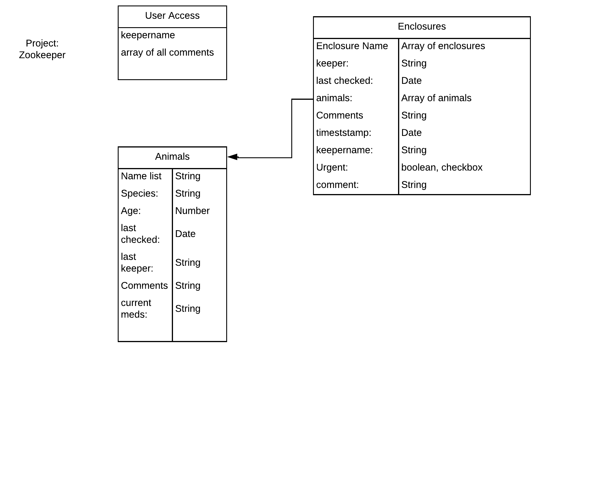
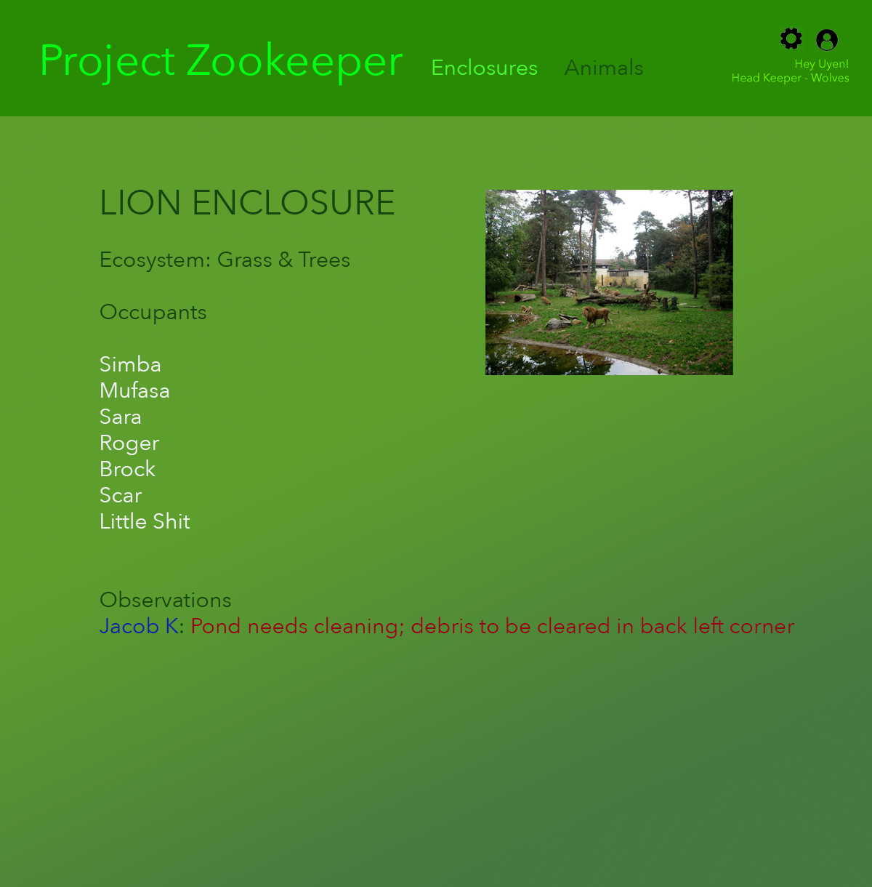
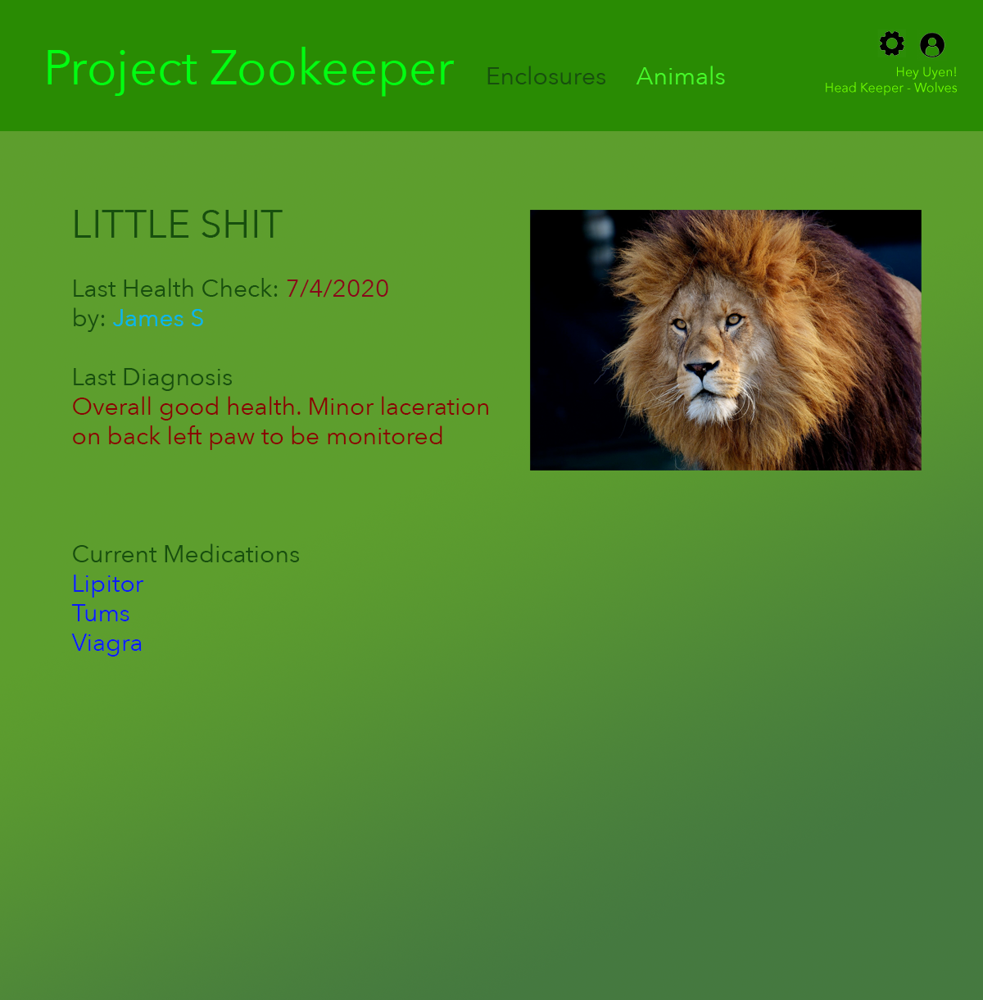

# Project ZooKeeper

## Welcome to the Jungle

Our goal for Project Two is to create a simple zoo management app that is informative, useful, and - if it all possible - fun. It will allow keepers to coordinate with each other and keep track of their enclosures and the animals within them.

### The Tech

Project Zookeeper will utilize:

* Express
* Node.js
* Mongoose
* MongoDB Atlas
* Javascript
* HTML5
* CSS

### Features

MVP - The user will have two sections to choose from: ENCLOSURES and ANIMALS.

ENCLOSURES will show a list of all the animal enclosures. Clicking on an enclosure will take the user to its show page where the user will see the relevant data:

* the type of ecosystem
* a list of the animal occupants (clickable links which will lead to the aninmal's show page)
* the name of the keeper in charge
* any observations/notes on the cleaniness and general upkeep of the enclosure.

Similarly, ANIMALS will show a clickable list of the animals by type (or enclosure). Clicking an animals name will navigate to its show page with the following data:

* its name
* its age
* it's most recent medical checkup/diagnosis
* whether it has been fed that day

The models will be organized as such:

And here's a (very) rough mock-up of what the pages will (possibly) look like:

### Stretch Goals

* implement some kind of User Auth/Login for Keepers
* add a home page with an interactive map of the zoo that displays at-a-glance data when you hover over each section
* more detailed data of each enclosure and animal, linked to the Keeper/User who last edited the page
* a comprehensive catalog of all edits made to a page
* a comprehensive catalog of each users comments and links to the relevant pages

### Screenshots

Coming soon.
